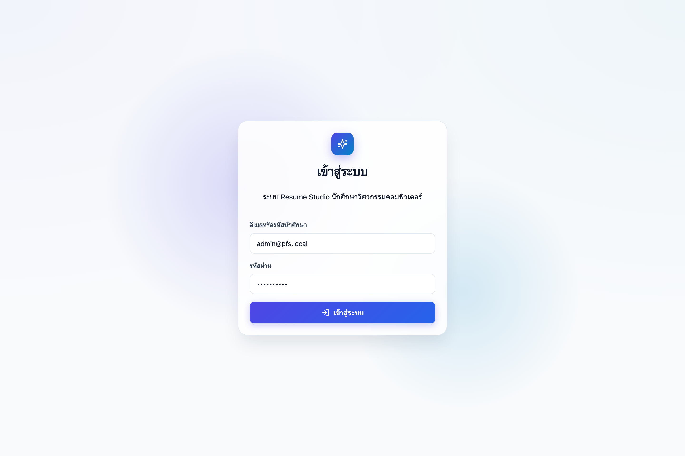
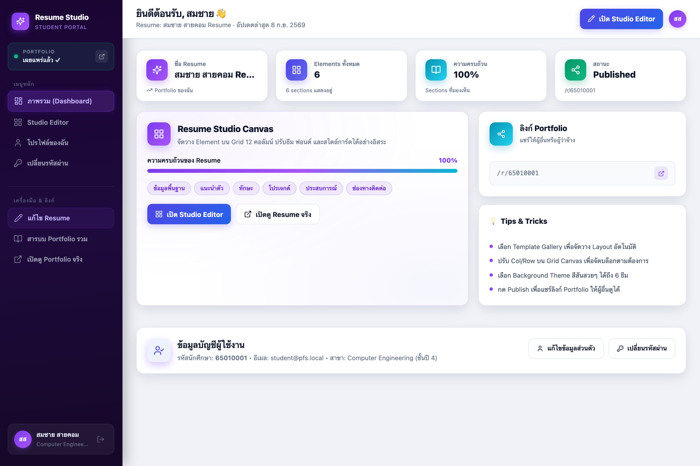
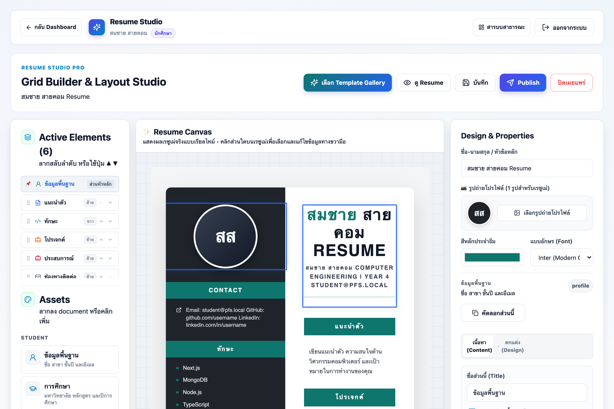
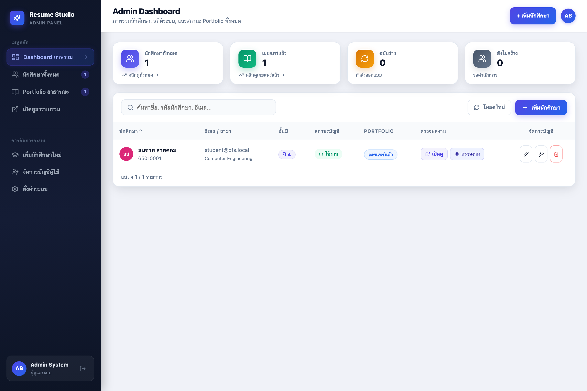
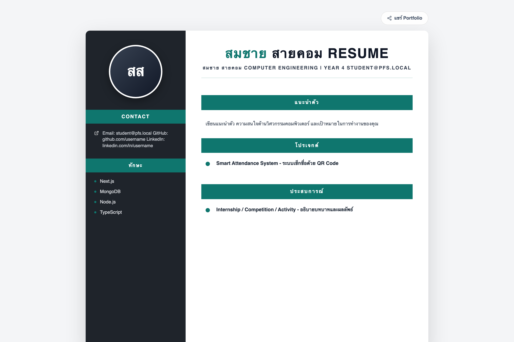

# 📖 คู่มือการใช้งานระบบแฟ้มสะสมผลงานออนไลน์ (PFS Official User Manual)

**โครงการ:** ระบบ Portfolio & Resume ออนไลน์สำหรับนักศึกษาวิศวกรรมคอมพิวเตอร์ (PFS)  
**กลุ่มเป้าหมาย:** นักศึกษา, อาจารย์ที่ปรึกษา, กรรมการตรวจงาน, และลูกค้า/ผู้ใช้งานทั่วไป  
**ระดับความง่าย:** ⭐⭐⭐⭐⭐ เข้าใจง่าย เหมาะสำหรับผู้ที่ไม่มีพื้นฐานด้านเทคโนโลยีเว็บ  
**เอกสารดาวน์โหลด:** [ดาวน์โหลดคู่มือฉบับสมบูรณ์ (Microsoft Word .docx)](file:///Users/surachartlimrattanaphun/Desktop/PFS/deliverables/USER_MANUAL.docx)

---

## 🌟 บทนำ: ระบบนี้คืออะไร และช่วยอะไรได้บ้าง?

ระบบ **PFS (Portfolio System)** คือ เว็บไซต์ที่ช่วยให้นักศึกษาสามารถจัดทำ **Resume และ Portfolio ดิจิทัล** ได้อย่างสวยงาม รวดเร็ว และเป็นมืออาชีพ ผ่านหน้าต่างเบราว์เซอร์ **โดยไม่ต้องเขียนโค้ด ไม่ต้องติดตั้งโปรแกรมลงในคอมพิวเตอร์ และไม่ต้องจัดหน้า Word หรือ Photoshop ให้ยุ่งยาก**

เมื่อสร้างเสร็จแล้ว ระบบจะมอบ **"ลิงก์ผลงานส่วนตัว"** (เช่น `https://portfolio.pfs.local/r/65010001`) ให้นักศึกษานำไปส่งให้อาจารย์ตรวจ หรือแนบในอีเมลสมัครงานกับบริษัทได้ทันที

---

## 👥 ภาพรวม: ใครใช้งานระบบนี้บ้าง?

ระบบแบ่งผู้ใช้งานออกเป็น **3 บทบาทหลัก** อย่างชัดเจน:

| บทบาทผู้ใช้งาน | ใครคือผู้ใช้? | ทำอะไรได้บ้างในระบบ? |
|---|---|---|
| 🎓 **นักศึกษา (Student)** | นักศึกษาทุกคนในสาขาวิชา | เข้าสู่ระบบ, เลือกหน้าตาเรซูเม่สำเร็จรูป, กรอกประวัติและผลงาน, ปรับแต่งสีและฟอนต์, บันทึกแบบร่าง และกดเผยแพร่เพื่อรับลิงก์แชร์ |
| 🛡️ **อาจารย์ / ผู้ดูแล (Admin)** | อาจารย์ที่ปรึกษา, ฝ่ายทะเบียน | ตรวจเช็กภาพรวมว่าใครส่งงานแล้วบ้าง, เปิดตรวจผลงานนักศึกษาเป็นรายบุคคล (แม้ยังเป็นแบบร่าง), เพิ่มบัญชี และรีเซ็ตรหัสผ่าน |
| 👥 **นายจ้าง / บุคคลทั่วไป (Visitor)** | บริษัท, กรรมการประเมิน, เพื่อน | เปิดชมหน้าเรซูเม่ของนักศึกษาผ่านลิงก์โดยไม่ต้องล็อกอิน และสั่งพิมพ์เป็น PDF ได้ทันที |

---

## 🚀 บทที่ 1: การเข้าสู่ระบบและการระบุตัวตน (Authentication)

ทุกครั้งที่ต้องการเริ่มใช้งานระบบ ให้เปิดโปรแกรมท่องเว็บ (Google Chrome, Safari, หรือ Microsoft Edge) แล้วเข้าไปที่หน้าเข้าสู่ระบบ



### ฟังก์ชัน 1.1: วิธีการเข้าสู่ระบบทีละขั้นตอน (Step-by-Step Login)
1. เข้าไปที่หน้าเว็บ `/login`
2. **ช่องระบุตัวตน (Username / Email):**
   * สำหรับ **นักศึกษา**: พิมพ์ **รหัสนักศึกษา 8-13 หลัก** (เช่น `65010001`) หรืออีเมลที่แจ้งไว้กับภาควิชา
   * สำหรับ **อาจารย์ / ผู้ดูแล**: พิมพ์อีเมลประจำตำแหน่ง (เช่น `admin@pfs.local`)
3. **ช่องรหัสผ่าน (Password):** กรอกรหัสผ่านส่วนตัวของท่าน
4. คลิกปุ่มสีน้ำเงิน **"เข้าสู่ระบบ (Sign In)"**

### ฟังก์ชัน 1.2: การนำทางและแยกสิทธิ์อัตโนมัติ (Role-based Redirection)
ระบบได้รับการออกแบบให้แยกหน้าจอให้อัตโนมัติ:
* หากเข้าสู่ระบบด้วยบัญชีนักศึกษา $\rightarrow$ พุ่งตรงไปยังหน้าแดชบอร์ดนักศึกษา `/student`
* หากเข้าสู่ระบบด้วยบัญชีผู้ดูแล $\rightarrow$ พุ่งตรงไปยังศูนย์ควบคุมผู้ดูแล `/admin`

> [!TIP]
> **ข้อแนะนำความปลอดภัย:** หากเข้าสู่ระบบครั้งแรกสำเร็จ แนะนำให้เข้าไปที่เมนู **"เปลี่ยนรหัสผ่าน"** ทันที เพื่อตั้งรหัสผ่านใหม่ที่เป็นความลับเฉพาะตัวท่าน

---

## 🎓 บทที่ 2: คู่มือสำหรับ "นักศึกษา" (Student Guide)

### 2.1 หน้าแดชบอร์ดของฉัน (Student Dashboard)

หลังจากเข้าสู่ระบบแล้ว นักศึกษาจะพบกับหน้าแดชบอร์ดส่วนตัว ซึ่งเป็นศูนย์รวมข้อมูลและสถานะการทำงานทั้งหมด



#### 📌 ฟังก์ชันการทำงานบนหน้าแดชบอร์ด:

1. **ฟังก์ชัน 2.1.1 — ตรวจสอบสถานะผลงานและความสมบูรณ์ (Status & Completion):**
   * การ์ดสรุปจะรายงานว่าเรซูโม่อยู่ในสถานะ **"เผยแพร่แล้ว (Published)"** สีเขียว หรือ **"แบบร่าง (Draft)"** สีส้ม
   * แถบเปอร์เซ็นต์ความสมบูรณ์เนื้อหา (% Completion) จะคำนวณอัตโนมัติจากจำนวนหมวดหมู่ที่ท่านกรอกข้อมูล
2. **ฟังก์ชัน 2.1.2 — การคัดลอกลิงก์ผลงานไปส่งอาจารย์/สมัครงาน (Quick Copy Link):**
   * กล่องสีน้ำเงินจะแสดง **Public URL** ประจำตัวของท่าน
   * เพียงคลิกปุ่มสีเขียว **"คัดลอกลิงก์ (Copy)"** ระบบจะก๊อบปี้ลิงก์ลงคลิปบอร์ดทันที สามารถนำไปวางส่งอาจารย์ทางแชต หรือแนบในอีเมลสมัครงานได้ทันที
   * หากต้องการตรวจสอบหน้าตาที่คนอื่นเห็น ให้คลิกปุ่ม **"เปิดดูหน้าจริง (View Live)"**
3. **ฟังก์ชัน 2.1.3 — การแก้ไขข้อมูลส่วนตัว (Profile Management):**
   * คลิกปุ่ม **"แก้ไขโปรไฟล์"** เพื่อแก้ไขชื่อภาษาไทย/อังกฤษ แผนกวิชา หรือระดับชั้นปี แล้วกดปุ่มบันทึก
4. **ฟังก์ชัน 2.1.4 — การเปลี่ยนรหัสผ่าน (Change Password):**
   * คลิกปุ่ม **"เปลี่ยนรหัสผ่าน"** กรอกรหัสเดิม และรหัสใหม่ที่ต้องการ 2 ครั้ง แล้วกดยืนยัน

---

### 2.2 สตูดิโอออกแบบผลงานแบบกริด (Studio Grid Canvas Editor)

เมื่อคลิกปุ่ม **"เข้าสู่สตูดิโอออกแบบ (Edit Canvas)"** จากหน้าแดชบอร์ด จะเข้าสู่หน้าจอออกแบบผลงาน ซึ่งแบ่งพื้นที่ทำงานออกเป็น 3 โซนหลัก:



#### 📌 ฟังก์ชันการทำงานในสตูดิโอ:

* **ฟังก์ชัน 2.2.1 — การเลือกเทมเพลตสำเร็จรูปในคลิกเดียว (Template Gallery):**
  * คลิกปุ่ม **"เลือกเทมเพลต"** บนแถบคำสั่งด้านบน
  * มีสไตล์ให้เลือก เช่น **Professional** (ทางการ น่าเชื่อถือ), **Modern Minimal** (เรียบหรู ทันสมัย), **Creative** (โดดเด่น สดใส), และ **Tech Engineer** (วิศวกรรมคอมพิวเตอร์)
  * คลิกเลือกแล้วหน้าตาเรซูเม่จะเปลี่ยนโครงสร้างทันที

* **ฟังก์ชัน 2.2.2 — การเพิ่มบล็อกหมวดหมู่เนื้อหา (Blocks Library - แผงซ้าย):**
  * คลิกเลือกหัวข้อที่ต้องการเพิ่ม เช่น:
    * `👤 ข้อมูลส่วนตัว (Profile)`: รูปถ่าย, ชื่อ-นามสกุล, ข้อมูลติดต่อ
    * `📝 แนะนำตัว (About Me)`: สรุปความสนใจ เป้าหมาย และจุดเด่น
    * `🎓 การศึกษา (Education)`: มหาวิทยาลัย วุฒิการศึกษา ชั้นปี
    * `⚡ ทักษะความเชี่ยวชาญ (Skills)`: ภาษาโปรแกรมมิ่ง ซอฟต์แวร์ และเครื่องมือ
    * `🚀 โครงงานเด่น (Projects)`: ผลงาน โปรเจกต์วิชาเรียน แอปพลิเคชัน ลิงก์ GitHub
    * `💼 ประสบการณ์ (Experience)`: การฝึกงาน กิจกรรม การแข่งขัน
    * `🏆 เกียรติบัตร (Certificates)`: รางวัลและใบรับรอง
    * `📬 ติดต่อ (Contact)`: เบอร์โทร อีเมล ลิงก์โซเชียล
  * การ์ดจะถูกสร้างลงบนผืนผ้าใบ Canvas ตรงกลางทันที

* **ฟังก์ชัน 2.2.3 — การจัดผังตารางและปรับขนาดการ์ด (Grid Layout & Sizing):**
  * **ปรับขนาดการ์ด:** คลิกที่การ์ด $\rightarrow$ ในแผงขวามือสามารถเลือกได้ว่าจะให้กว้าง **"เต็มหน้าจอ (12 คอลัมน์)"** หรือ **"ครึ่งหน้าจอ (6 คอลัมน์)"** เพื่อจัดวางคู่กัน 2 ฝั่งอย่างสวยงาม
  * **เลื่อนลำดับ:** กดปุ่มลูกศร `▲` ขึ้น หรือ `▼` ลง บนการ์ด เพื่อสลับตำแหน่งบน-ล่าง
  * **ซ่อน/แสดงการ์ด:** กดไอคอนรูปดวงตา เพื่อซ่อนหัวข้อนั้นไว้ชั่วคราวโดยไม่ต้องลบทิ้ง

* **ฟังก์ชัน 2.2.4 — การพิมพ์และแก้ไขเนื้อหา (Content Inspector - แผงขวา):**
  * เมื่อคลิกเลือกการ์ดใดๆ บน Canvas แผงด้านขวาในแท็บ **"เนื้อหา (Content)"** จะให้ท่าน:
    * เปลี่ยนชื่อหัวข้อบล็อก
    * พิมพ์ข้อความบรรยายรายละเอียด
    * เพิ่มรายการทักษะ หรือลิสต์ผลงานโครงงาน พร้อมแนบลิงก์ภายนอกได้ไม่จำกัด

* **ฟังก์ชัน 2.2.5 — การปรับแต่งสีสันและฟอนต์ (Design & Styling Inspector):**
  * ในแท็บ **"ดีไซน์ (Design)"** ของแผงขวา:
    * **จานสี (Color Swatches):** เปลี่ยนสีธีมของการ์ดได้อิสระ
    * **แบบอักษร (Typography):** เลือกฟอนต์ยอดนิยม เช่น `Prompt`, `Kanit`, `Inter`, `Fira Code`
    * **การจัดตำแหน่งข้อความ:** ชิดซ้าย, กึ่งกลาง, หรือชิดขวา

* **ฟังก์ชัน 2.2.6 — การลบบล็อกที่ไม่ต้องการ:**
  * หากไม่ต้องการใช้หมวดหมู่นั้น ให้คลิกปุ่มถังขยะสีแดงที่แผงขวา เพื่อลบการ์ดออกจากเรซูเม่

---

### 2.3 การเซฟงานและการเผยแพร่ (Save Draft vs Publish)

| สถานะ | ปุ่มที่ต้องคลิก | คนอื่นเปิดดูได้ไหม? | เหมาะสำหรับช่วงเวลาไหน? |
|---|:---:|:---:|---|
| **แบบร่าง (Draft)** | ปุ่มสีส้ม **"บันทึกฉบับร่าง"** | ❌ **ยังไม่ได้** (คนอื่นเปิดแล้วจะพบข้อความว่ายังไม่เผยแพร่) | ช่วงที่กำลังพิมพ์งาน ยังทำไม่เสร็จ หรืออยากทดลองเปลี่ยนดีไซน์เป็นการส่วนตัว |
| **เผยแพร่แล้ว (Published)** | ปุ่มสีเขียว **"เผยแพร่ (Publish)"** | ✅ **เปิดดูได้ทันที** ผ่านลิงก์ `/r/[slug]` | เมื่อจัดหน้าตาและตรวจเช็กข้อมูลเรียบร้อยแล้ว พร้อมส่งให้อาจารย์หรือบริษัท |
| **ปิดการเผยแพร่ (Unpublish)** | ปุ่มสีเทา **"ปิดการเผยแพร่"** | ❌ **ปิดการเข้าชม** ลิงก์จะกลับเป็นแบบร่าง | เมื่อต้องการปิดรับชมผลงานชั่วคราวเพื่อปรับปรุงเนื้อหาชุดใหญ่ |

> [!IMPORTANT]
> **ข้อควรระวังสำคัญที่สุด:** หากนักศึกษาแต่งหน้าตาเสร็จแล้วแต่**ไม่ได้กดปุ่ม "เผยแพร่ (Publish)"** อาจารย์หรือนายจ้างที่ได้รับลิงก์จะไม่สามารถเปิดดูผลงานได้ ดังนั้นเมื่อแต่งเสร็จทุกครั้ง **ต้องกดปุ่มเผยแพร่สีเขียว** ด้วยนะครับ!

---

## 🛡️ บทที่ 3: คู่มือสำหรับ "อาจารย์และผู้ดูแลระบบ" (Admin Guide)

สำหรับอาจารย์ที่ปรึกษา หัวหน้าสาขาวิชา หรือเจ้าหน้าที่ดูแลระบบ หน้าต่างนี้คือศูนย์รวมสำหรับติดตามการส่งงานของนักศึกษาทั้งรุ่น



### 📌 ฟังก์ชันการทำงานของผู้ดูแลระบบ:

* **ฟังก์ชัน 3.1 — การตรวจดูสถิติภาพรวมทั้งรุ่น (Overview Metrics):**
  * ดูตัวเลขรวมได้ทันที: มีนักศึกษาทั้งหมดกี่คน, **ส่งงานแล้วกี่คน (Published)**, อยู่ระหว่างทำกี่คน (Draft), และยังไม่เริ่มทำกี่คน
* **ฟังก์ชัน 3.2 — ระบบค้นหาและตัวกรอง (Search & Filter):**
  * พิมพ์ชื่อ, รหัสนักศึกษา หรืออีเมลในช่องค้นหา เพื่อเจาะจงดูข้อมูลนักศึกษาที่ต้องการแบบเรียลไทม์
  * คลิกแท็บตัวกรองเพื่อเลือกดูเฉพาะคนที่ยังไม่ส่งงาน หรือคนที่ส่งงานแล้วได้ทันที
* **ฟังก์ชัน 3.3 — การเปิดตรวจผลงานที่เผยแพร่แล้ว (View Published Portfolio):**
  * คลิกปุ่ม **"เปิดดู >" (สีน้ำเงิน)** ในแถวของนักศึกษา เพื่อเปิดดูเรซูเม่หน้าจริงแบบที่คนภายนอกเห็นและประเมินให้คะแนน
* **ฟังก์ชัน 3.4 — ฟังก์ชันพิเศษ: การเปิดตรวจแบบร่าง (Draft Review 🔍):**
  * สำหรับนักศึกษาที่ยังทำไม่เสร็จ (สถานะเป็นแบบร่าง) อาจารย์สามารถคลิกปุ่ม **"ตรวจแบบร่าง 🔍" (สีส้ม)** เพื่อเข้าไปดูความคืบหน้าของงานได้ แม้ว่านักศึกษาจะยังไม่ได้กดเผยแพร่ก็ตาม
* **ฟังก์ชัน 3.5 — การเพิ่มบัญชีนักศึกษาใหม่ (+ Add Student):**
  * คลิกปุ่มสีม่วง **"+ Add Student"** แล้วกรอกรหัสนักศึกษา, ชื่อ-นามสกุล, อีเมล, รหัสผ่านเริ่มต้น, และชั้นปี ระบบจะเปิดบัญชีให้ทันที
* **ฟังก์ชัน 3.6 — การรีเซ็ตรหัสผ่านให้นักศึกษา (Reset Password):**
  * กรณีนักศึกษาลืมรหัสผ่าน เพียงค้นหาชื่อนักศึกษาแล้วคลิกปุ่ม **"รีเซ็ต" (ไอคอนรูปกุญแจ 🔑)** ระบบจะตั้งรหัสผ่านใหม่ให้นักศึกษาได้ทันทีใน 5 วินาที
* **ฟังก์ชัน 3.7 — การแก้ไขข้อมูลและจัดการสถานะบัญชี (Edit & Status Toggle):**
  * คลิกปุ่ม **"แก้ไข"** เพื่อปรับปรุงข้อมูลส่วนตัวของนักศึกษา
  * คลิกปุ่ม **"เปิด/ปิดบัญชี" (ไอคอน Power)** เพื่อเปลี่ยนสถานะเป็น `Inactive` (ระงับชั่วคราว) หรือ `Active` (เปิดใช้งาน)

---

## 👥 บทที่ 4: สำหรับ "ผู้เข้าชมทั่วไปและนายจ้าง" (Visitor & Employer)

ผู้เข้าชมภายนอก (เช่น นายจ้าง, ฝ่ายบุคคล HR บริษัทไอที, หรือกรรมการประเมิน) สามารถเปิดดูผลงานได้ง่ายๆ ดังนี้:



* **ฟังก์ชัน 4.1 — เปิดชมผ่านลิงก์โดยตรง (Direct URL):**
  * คลิกเปิดจากลิงก์เฉพาะของนักศึกษาที่แนบมา (เช่น `/r/65010001`) เพื่อเข้าชมเรซูเม่ได้ทันทีโดยไม่ต้องเข้าสู่ระบบ
* **ฟังก์ชัน 4.2 — เปิดชมทำเนียบผลงานรวม (Public Showcase):**
  * เข้าหน้าเว็บ `/dashboard` เพื่อเลือกชมทำเนียบ Portfolio ของนักศึกษาทั้งหมดที่เปิดเผยแพร่สาธารณะ
* **ฟังก์ชัน 4.3 — การพิมพ์หรือบันทึกเป็น PDF (Print to PDF):**
  * เมื่อเปิดหน้าเรซูเม่ ให้กดปุ่ม `Ctrl + P` (Windows) หรือ `Cmd + P` (Mac)
  * เลือกปลายทางเป็น **"Save as PDF"** ระบบมี CSS Print Stylesheet จัดขอบกระดาษ A4 ให้อัตโนมัติ สามารถเซฟเป็นไฟล์ PDF นำไปใช้งานต่อได้ทันที

---

## 🔄 บทที่ 5: สรุปขั้นตอนการทำงานตั้งแต่ต้นจนจบ (End-to-End Workflow)

```
[1. อาจารย์/แอดมิน]               [2. นักศึกษา]                   [3. สตูดิโอออกแบบ]                 [4. ส่งงาน/ตรวจงาน]
------------------               ------------                   -----------------                 -------------------
สร้างบัญชีนักศึกษา  ========>  เข้าสู่ระบบ (/login)  =====>  เลือกเทมเพลตสำเร็จรูป   =====>  กดปุ่ม "เผยแพร่ (Publish)"
กำหนดรหัสผ่านเริ่มต้น            เปลี่ยนรหัสผ่านใหม่             เพิ่มบล็อก: ทักษะ, โปรเจกต์       คัดลอกลิงก์ /r/[slug] ส่งอาจารย์
                                เข้าสู่แดชบอร์ดนักศึกษา         ปรับแต่งสี และฟอนต์ที่ชอบ        อาจารย์เปิดตรวจให้คะแนนได้ทันที
```

---

## ❓ บทที่ 6: คำถามที่พบบ่อยและการแก้ปัญหา (FAQ)

### Q1: ส่งลิงก์ผลงานให้อาจารย์แล้ว อาจารย์แจ้งว่าเปิดไม่ติด ขึ้นว่าไม่พบหน้าเว็บ?
* **สาเหตุ:** นักศึกษาอาจจะกดแค่ปุ่ม "บันทึกฉบับร่าง (Save Draft)" แต่ยังไม่ได้กดปุ่ม **"เผยแพร่ (Publish)"**
* **วิธีแก้:** ให้นักศึกษาเปิดหน้า `/student/editor` แล้วคลิกปุ่มสีเขียว **"เผยแพร่ (Publish)"** ด้านบนขวา 1 ครั้ง จากนั้นส่งลิงก์ให้อาจารย์อีกครั้ง

---

### Q2: ลืมรหัสผ่านเข้าใช้งานระบบ ต้องทำอย่างไร?
* **วิธีแก้:** ให้นักศึกษาแจ้งอาจารย์ผู้ดูแลระบบ หรือฝ่ายทะเบียน อาจารย์สามารถเข้าไปที่หน้า `/admin` ค้นหารหัสนักศึกษา แล้วกดปุ่ม **"รีเซ็ต"** เพื่อตั้งรหัสผ่านใหม่ให้นักศึกษาได้ทันทีในเวลาไม่กี่วินาที

---

### Q3: แก้ไขข้อมูลในเรซูเม่แล้ว คนที่เปิดดูลิงก์จะเห็นข้อมูลใหม่ทันทีเลยไหม?
* **คำตอบ:** เมื่อกดปุ่ม **"เผยแพร่ (Publish)"** ระบบจะอัปเดตข้อมูลขึ้นเซิร์ฟเวอร์ทันที คนที่เปิดลิงก์อยู่เพียงแค่กด Refresh (F5) หน้าเว็บก็จะเห็นข้อมูลล่าสุดทันที

---

### Q4: ทำงานค้างไว้ แล้วเผลอปิดแท็บเบราว์เซอร์หรือไฟดับ ข้อมูลจะหายไหม?
* **คำตอบ:** หากท่านเคยกดปุ่ม **"บันทึกฉบับร่าง (Save Draft)"** ข้อมูลจะถูกบันทึกไว้อย่างปลอดภัยบนฐานข้อมูล ไม่สูญหายแน่นอน เมื่อเปิดเข้ามาใหม่ระบบจะดึงข้อมูลเดิมขึ้นมาให้ทำต่อทันที

---

### Q5: หน้าจอขึ้นแจ้งเตือนว่า "บัญชีนี้ถูกปิดใช้งาน (Inactive)" เกิดจากอะไร?
* **คำตอบ:** บัญชีของท่านอาจถูกระงับการใช้งานชั่วคราวจากผู้ดูแลระบบ ให้ติดต่ออาจารย์ผู้ดูแลระบบเพื่อเปิดสถานะบัญชีกลับเป็น `Active`

---

## 📞 บทที่ 7: ช่องทางการติดต่อและสนับสนุนระบบ

* **หน่วยงานผู้รับผิดชอบ:** ภาควิชาวิศวกรรมคอมพิวเตอร์
* **ผู้ดูแลระบบ (Admin Email):** `admin@pfs.local`
* **เอกสารฉบับนี้จัดทำขึ้นสำหรับ:** โครงงานวิศวกรรมคอมพิวเตอร์ (PFS Web Application)
