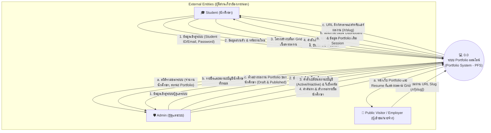

# 🌐 Context Diagram (DFD Level 0)

**โครงการ:** ระบบ Portfolio ออนไลน์สำหรับนักศึกษาวิศวกรรมคอมพิวเตอร์ (PFS)  
**เอกสารประกอบ:** สัปดาห์ที่ 8-9 (System Analysis & Design)

---

## 1. ภาพรวม Context Diagram

Context Diagram (หรือ Data Flow Diagram Level 0) แสดงขอบเขตสูงสุดของระบบ (System Boundary) ปฏิสัมพันธ์ระหว่างระบบจัดการ Portfolio ออนไลน์กับ External Entities ภายนอก 3 กลุ่มหลัก ได้แก่:
1. **Student (นักศึกษา)**
2. **Admin (ผู้ดูแลระบบ)**
3. **Public Visitor / Employer (ผู้เข้าชมทั่วไป / ผู้ว่าจ้าง)**

---

## 2. แผนภาพแสดงการไหลของข้อมูล (Mermaid Diagram)

---

## 3. ตารางวิเคราะห์กระแสข้อมูล (Data Flow Dictionary)

### 3.1 ข้อมูลนำเข้าสู่ระบบ (Inputs to System)
| จาก Entity | ชื่อกระแสข้อมูล (Data Flow) | คำอธิบายรายละเอียดของข้อมูล |
|---|---|---|
| **Student** | ข้อมูลเข้าสู่ระบบ | รหัสนักศึกษา/อีเมล และรหัสผ่านเพื่อยืนยันตัวตน |
| **Student** | ข้อมูลส่วนตัว & บัญชี | ชื่อ, นามสกุล, ภาควิชา, ชั้นปี, รหัสผ่านเดิมและใหม่ |
| **Student** | ข้อมูลและบล็อก Portfolio | ประเภท Section, ข้อมูลข้อความ, ทักษะ, ลิงก์โปรเจกต์, รูปภาพ |
| **Student** | ค่าการจัดวาง Layout & Design | Col Start/End, Row Start/End, ธีมสี, ฟอนต์, สไตล์การ์ด, คำสั่งบันทึกหรือ Publish |
| **Admin** | ข้อมูลจัดการนักศึกษา | ข้อมูลนักศึกษาใหม่ (รหัส, ชื่อ, อีเมล, ชั้นปี, รหัสผ่านเริ่มต้น) หรือข้อมูลที่ต้องการแก้ไข |
| **Admin** | คำสั่งบริหารจัดการบัญชี | คำสั่งสลับสถานะ `active/inactive`, คำสั่งรีเซ็ตรหัสผ่าน, คำสั่งลบบัญชี |
| **Admin** | คำค้นหาและตัวกรอง | คำค้นหาชื่อ/รหัส, คีย์สำหรับการจัดเรียงข้อมูล |
| **Visitor** | URL Request | คำขอเปิดหน้า Portfolio ผ่านพารามิเตอร์ `slug` |

### 3.2 ข้อมูลส่งออกจากระบบ (Outputs from System)
| ไปยัง Entity | ชื่อกระแสข้อมูล (Data Flow) | คำอธิบายรายละเอียดของข้อมูล |
|---|---|---|
| **Student** | ผลยืนยันตัวตน & สิทธิ์ | ผลการเข้าสู่ระบบ, Session Cookie ที่เข้ารหัส, การนำทางไปยังหน้า Dashboard |
| **Student** | ข้อมูลและสถานะ Portfolio | ข้อมูลบล็อกบน Canvas, ค่าเปอร์เซ็นต์ความสมบูรณ์, ลิงก์สาธารณะ |
| **Admin** | สถิติภาพรวมระบบ | จำนวนนักศึกษาทั้งหมด, จำนวน Portfolio ที่เผยแพร่แล้ว, ฉบับร่าง, ยังไม่สร้าง |
| **Admin** | รายชื่อและสถานะนักศึกษา | ตารางรายชื่อ, อีเมล, ชั้นปี, สถานะบัญชี, สถานะ Portfolio |
| **Admin** | ข้อมูลผลงานนักศึกษา | หน้าพรีวิวผลงานของนักศึกษาทั้งฉบับร่างและเผยแพร่แล้ว |
| **Visitor** | หน้าเว็บแสดงผลงาน | โครงสร้าง HTML/CSS Grid ของ Resume พร้อมข้อมูลผลงาน ทักษะ และการติดต่อ |
