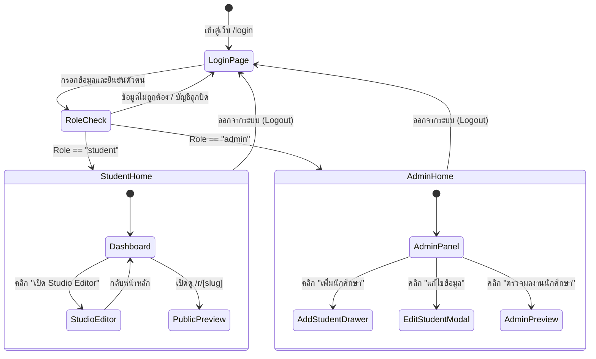

# 🗺️ Sitemap & Navigation Architecture (แผนผังเว็บไซต์)

**โครงการ:** ระบบ Portfolio ออนไลน์สำหรับนักศึกษาวิศวกรรมคอมพิวเตอร์ (PFS)  
**เอกสารประกอบ:** สัปดาห์ที่ 8-9 (System Analysis & Design)

---

## 1. ผังโครงสร้างเว็บไซต์ (Sitemap Hierarchy)

ระบบถูกออกแบบภายใต้สถาปัตยกรรม Next.js App Router โดยแบ่งออกเป็น 3 โซนสิทธิ์การเข้าถึงอย่างชัดเจน:
1. **Public Zone (บุคคลทั่วไป)**
2. **Student Zone (นักศึกษา)**
3. **Admin Zone (ผู้ดูแลระบบ)**

```text
                                [ PFS Web Application ]
                                           │
         ┌─────────────────────────────────┼─────────────────────────────────┐
         │                                 │                                 │
   [ Public Zone ]                  [ Student Zone ]                  [ Admin Zone ]
   (สิทธิ์: ทุกคน)                     (สิทธิ์: Student)                  (สิทธิ์: Admin)
         │                                 │                                 │
         ├─ / (Landing / Auto-Route)       ├─ /student (Dashboard)           ├─ /admin (Dashboard)
         ├─ /login (เข้าสู่ระบบ)            │  ├─ ดูสถานะ & สถิติ              │  ├─ ดูสถิติรวมของระบบ
         ├─ /dashboard (สารบบสาธารณะ)      │  ├─ ลิงก์แชร์ Portfolio          │  ├─ ค้นหา/กรองนักศึกษา
         └─ /r/[slug] (หน้า Portfolio)     │  ├─ แก้ไขข้อมูลส่วนตัว          │  ├─ เพิ่มนักศึกษาใหม่
            └─ /p/[slug] (Rewrite alias)   │  └─ เปลี่ยนรหัสผ่าน              │  ├─ แก้ไขข้อมูลนักศึกษา
                                           │                                 │  ├─ ปิด/เปิดใช้งานบัญชี
                                           └─ /student/editor                │  ├─ รีเซ็ตรหัสผ่าน
                                              ├─ 12-Column Grid Canvas       │  ├─ ลบบัญชีนักศึกษา
                                              ├─ Asset Blocks (Drag/Add)     │  └─ /admin/preview/[userId]
                                              ├─ Template Gallery 6 แบบ      │     (ตรวจแบบร่าง Portfolio)
                                              ├─ Property Inspector          │
                                              └─ Save / Publish / Unpublish  └─ Logout
```

---

## 2. ตารางรายละเอียดเส้นทาง (Route Specifications & Access Control)

| Route (URL) | ชื่อหน้าจอ (Page Title) | สิทธิ์การเข้าถึง (Access Role) | วัตถุประสงค์และการทำงาน |
|---|---|---|---|
| `/` | Landing / Redirect | Public (ทุกคน) | นำทางผู้ใช้ไปยัง `/login` หรือส่งต่อไปยัง Dashboard ของตนเองหากมี Session อยู่แล้ว |
| `/login` | เข้าสู่ระบบ | Public (ทุกคน) | หน้าแบบฟอร์มล็อกอิน รองรับรหัสนักศึกษา/อีเมล มีการตรวจสอบสถานะและส่งต่อไปยังหน้าตามบทบาท |
| `/dashboard` | ทำเนียบ Portfolio สาธารณะ | Public (ทุกคน) | สารบัญค้นหาและรวบรวม Portfolio ของนักศึกษาทั้งหมดที่เปิดเผยแพร่แล้ว |
| `/r/[slug]` | หน้านำเสนอ Portfolio | Public (ทุกคน) | แสดงผล Resume / Portfolio ฉบับสมบูรณ์ตาม URL Slug ที่นักศึกษาแชร์ออกไป |
| `/student` | Student Dashboard | Student เท่านั้น | หน้าหลักของนักศึกษา แสดงความสมบูรณ์ของผลงาน ลิงก์แชร์ และปุ่มลัดเข้าสู่ Studio Canvas |
| `/student/editor` | Studio Grid Canvas Editor | Student เท่านั้น | หน้าจอออกแบบ Interactive Grid 12 คอลัมน์ ลากวางบล็อก ปรับสี ฟอนต์ และจัดการ Publish |
| `/admin` | Admin Dashboard | Admin เท่านั้น | หน้าศูนย์ควบคุมของผู้ดูแลระบบ บริหารจัดการรายชื่อนักศึกษา สถานะบัญชี และตรวจสอบผลงาน |
| `/admin/preview/[userId]`| ตรวจสอบ Portfolio นักศึกษา | Admin เท่านั้น | หน้าจอสำหรับ Admin เปิดตรวจงาน Portfolio ของนักศึกษาเป็นรายคน แม้จะยังเป็นฉบับร่าง (Draft) |

---

## 3. ผังการนำทางของผู้ใช้งาน (Navigation Flow)


