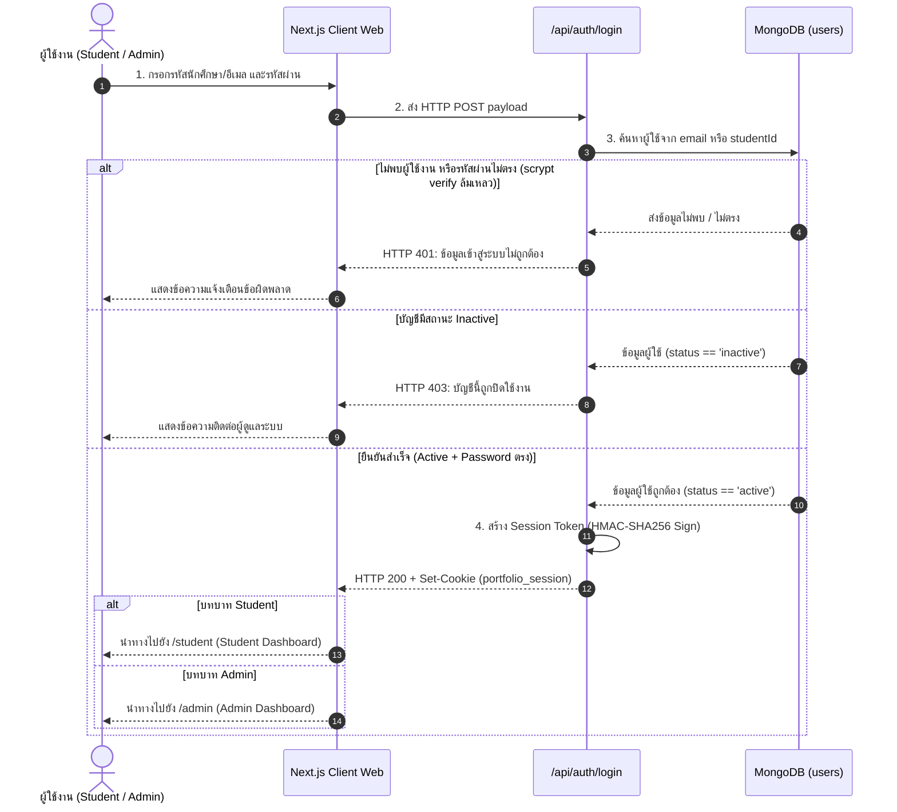
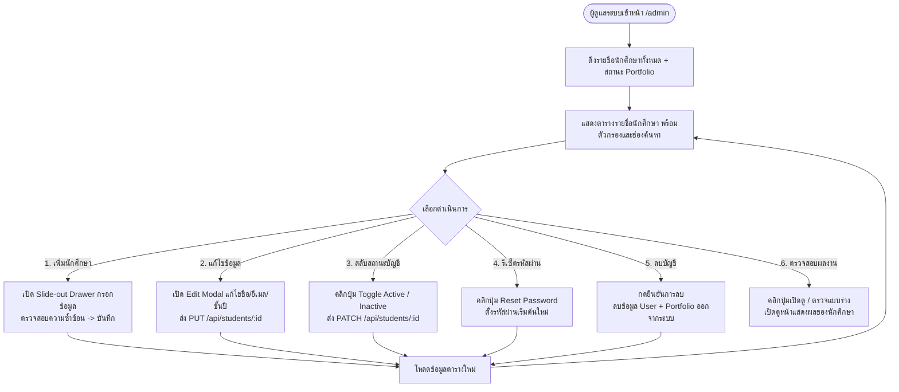

# ⚙️ กระบวนการทำงานหลักของระบบ (Work Processes & Workflows)

**โครงการ:** ระบบ Portfolio ออนไลน์สำหรับนักศึกษาวิศวกรรมคอมพิวเตอร์ (PFS)  
**เอกสารประกอบ:** สัปดาห์ที่ 8-9 (System Analysis & Design)

---

## 1. กระบวนการที่ 1: การเข้าสู่ระบบและการแยกสิทธิ์ (Authentication & Role Routing)

กระบวนการตรวจสอบข้อมูลยืนยันตัวตนของผู้ใช้งาน พร้อมจำแนกสิทธิ์เพื่อส่งต่อไปยังหน้าจอการทำงานที่ถูกต้อง



---

## 2. กระบวนการที่ 2: การสร้าง ออกแบบ และเผยแพร่ Portfolio (Portfolio Design & Publishing Flow)

กระบวนการทำงานของนักศึกษาในการจัดวางบล็อกบนตารางกริด 12 คอลัมน์ จนถึงการสร้าง URL เผยแพร่

```mermaid
flowchart TD
    Start([เริ่ม: นักศึกษาเข้าหน้า /student/editor]) --> LoadData[โหลดข้อมูล Portfolio เดิม หรือสร้างใหม่อัตโนมัติ]
    LoadData --> ActionChoice{เลือกการกระทำ}

    ActionChoice -->|เลือก Template| ApplyTemplate[เลือกจาก 6 Preset Templates<br/>จัดโครงสร้าง Grid ใหม่ทันที]
    ActionChoice -->|เพิ่ม Block ใหม่| AddBlock[คลิกหรือลากบล็อกจาก Assets Library<br/>(Profile, Skills, Projects, ฯลฯ)]
    ActionChoice -->|แก้ไข Element| SelectCard[คลิกการ์ดบน 12-Column Grid Canvas]

    ApplyTemplate --> CanvasUpdate[อัปเดตการแสดงผลบน Canvas]
    AddBlock --> CanvasUpdate

    SelectCard --> EditProp[เปิด Inspector Panel ด้านขวา<br/>- ปรับข้อความ & ข้อมูลย่อย<br/>- ปรับ Col/Row Grid (1-12)<br/>- เลือก Card Variant & สไตล์ขอบ]
    EditProp --> CanvasUpdate

    CanvasUpdate --> UserDecision{การบันทึก / เผยแพร่}

    UserDecision -->|กด บันทึก| SaveDraft[ส่ง PUT /api/portfolio/me<br/>สถานะยังคงเป็น Draft]
    SaveDraft --> SaveSuccess[แจ้งเตือน: บันทึกสำเร็จ]

    UserDecision -->|กด Publish| ValidateSlug[ตรวจสอบความถูกต้องของ Slug]
    ValidateSlug --> SavePublish[ส่ง POST /api/portfolio/me/publish<br/>อัปเดตสถานะเป็น 'published']
    SavePublish --> GenLink[สร้างลิงก์สาธารณะ /r/[slug]<br/>พร้อมปุ่มคัดลอกแชร์ผลงาน]

    UserDecision -->|กด ปิดเผยแพร่| Unpublish[ส่ง POST /api/portfolio/me/unpublish<br/>เปลี่ยนสถานะกลับเป็น 'draft']
    Unpublish --> GenLink
```

---

## 3. กระบวนการที่ 3: การบริหารจัดการนักศึกษาโดยผู้ดูแลระบบ (Admin Student Management Flow)

กระบวนการที่ผู้ดูแลระบบดูแลบัญชีผู้ใช้งานและกำกับติดตามการส่งงาน


