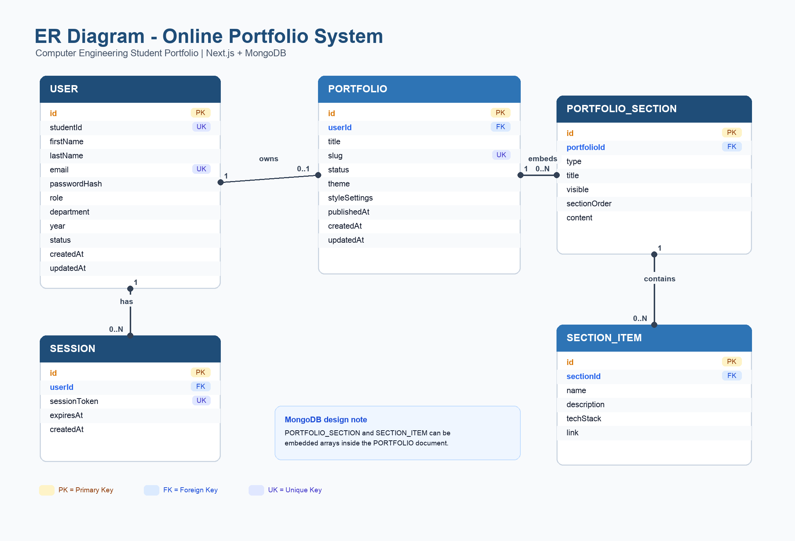
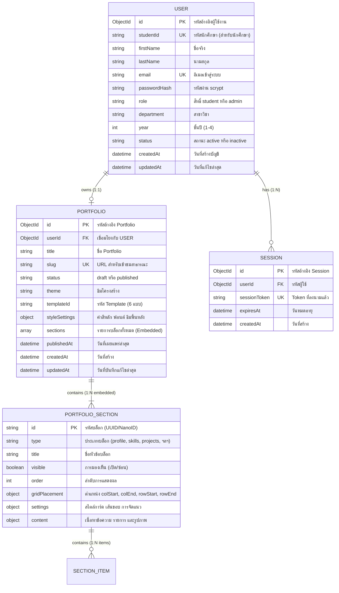

# 🗄️ การออกแบบฐานข้อมูลและแบบจำลองข้อมูล (Database Design & ERD)

**โครงการ:** ระบบ Portfolio ออนไลน์สำหรับนักศึกษาวิศวกรรมคอมพิวเตอร์ (PFS)  
**เอกสารประกอบ:** สัปดาห์ที่ 12 (Database Design & Data Dictionary)

---

## 1. แนวคิดและสถาปัตยกรรมฐานข้อมูล (Database Architecture)

ระบบเลือกใช้ **MongoDB (Document-oriented NoSQL Database)** เป็นระบบจัดการฐานข้อมูลหลัก เนื่องจากโครงสร้างข้อมูลของ Portfolio มีความหลากหลายสูงในแต่ละบุคคล (Heterogeneous Content) เช่น บางคนมีข้อมูลโปรเจกต์ 5 รายการ มีภาพประกอบ มีรายการทักษะที่จัดหมวดหมู่แบบไดนามิก การใช้ NoSQL จึงมีข้อได้เปรียบด้านความยืดหยุ่น (Schema Flexibility) และประสิทธิภาพในการอ่านข้อมูลทั้งหน้าด้วยคำสั่ง Query เพียงครั้งเดียว (Single-document read)

### 1.1 ระดับการออกแบบแบบจำลองข้อมูล (Three Data Model Levels)
1. **Conceptual Data Model:** จำลอง Entity หลักในเชิงธุรกิจ ได้แก่ ผู้ใช้งาน (User), ผลงาน (Portfolio), บล็อกเนื้อหา (Section), และประวัติการเข้าใช้งาน (Session)
2. **Logical Data Model (ER Model):** กำหนดความสัมพันธ์ระหว่าง Entities แบบ 1:1, 1:N และระบุ Primary Key / Foreign Key (แสดงในภาพ ERD)
3. **Physical Data Model (MongoDB Document Model):** ทำการ Denormalization โดยการฝัง (Embed) ข้อมูล `sections` และ `items` ไว้ภายในเอกสาร `portfolios` เพื่อเพิ่มประสิทธิภาพความเร็วในการ Query และบันทึกข้อมูลแบบ Atomic Operation

---

## 2. แผนภาพความสัมพันธ์เชิงแนวคิด (Entity-Relationship Diagram - ERD)

---

## 3. กลยุทธ์การจัดดัชนี (Database Indexing Strategy)

เพื่อเพิ่มความเร็วในการ Query และป้องกันข้อมูลซ้ำซ้อน ระบบได้กำหนด Index ดังนี้:

| Collection | ฟิลด์ที่ทำ Index | ชนิด Index | วัตถุประสงค์ |
|---|---|---|---|
| `users` | `{ email: 1 }` | Unique Index | ป้องกันการลงทะเบียนอีเมลซ้ำ และเร่งความเร็วในการค้นหาตอน Login |
| `users` | `{ studentId: 1 }` | Sparse Unique Index | ป้องกันรหัสนักศึกษาซ้ำสำหรับนักศึกษา |
| `users` | `{ role: 1, status: 1 }` | Compound Index | เพิ่มประสิทธิภาพการกรองรายชื่อใน Admin Dashboard |
| `portfolios` | `{ slug: 1 }` | Unique Index | ค้นหาหน้าเว็บสาธารณะ `/r/[slug]` ได้อย่างรวดเร็ว (O(1) lookup) |
| `portfolios` | `{ userId: 1 }` | Unique Index | นักศึกษา 1 คนมี Portfolio ได้ 1 ชุด (1-to-1 relationship) |
| `portfolios` | `{ status: 1 }` | Single Field Index | ค้นหา Portfolio ที่เผยแพร่แล้วในหน้าสารบัญรวม |
